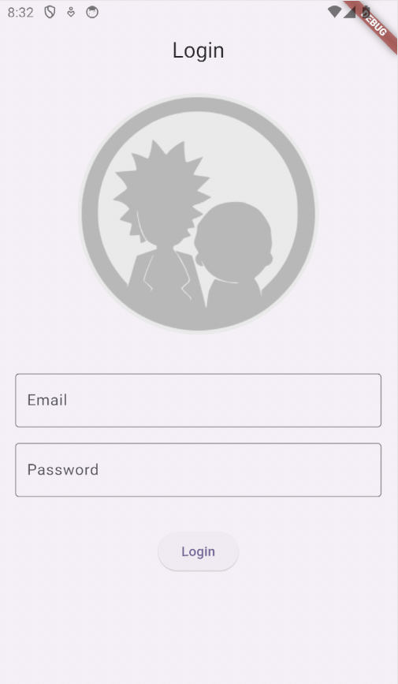
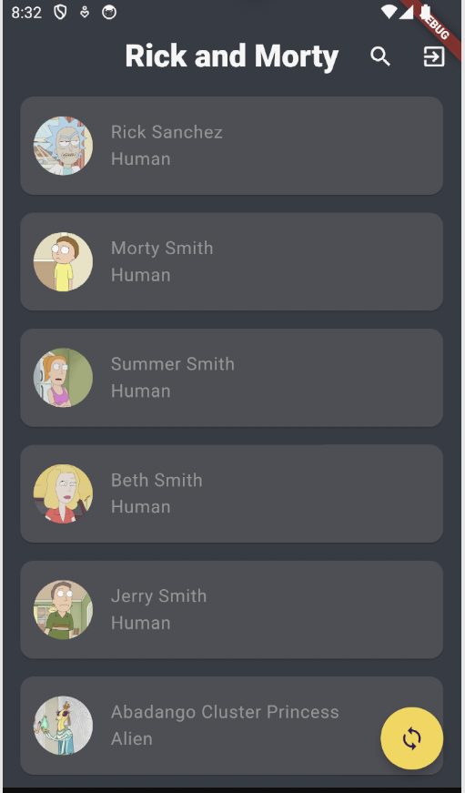
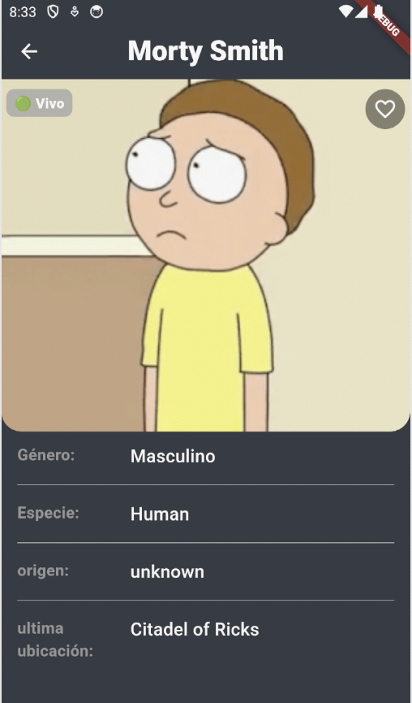

# RickAndMortyApiConsume

Application developed in Flutter with multi-user order taking and with main configuration

- Proyect Flutter
- Login:
  * Username: admin@example.com
  * Password: 123
- Structure base example Cubit with Clean_Arquitecture

  
  
  
  

# Aditional Complements

- Dio Class global.
- Methods.
- Errors.
- Constans Colors.
- Class Routes.
- Dependencies with Cubit.
- Hive.
- Logger.
- Equatable.
- bloc.
- get_it.

